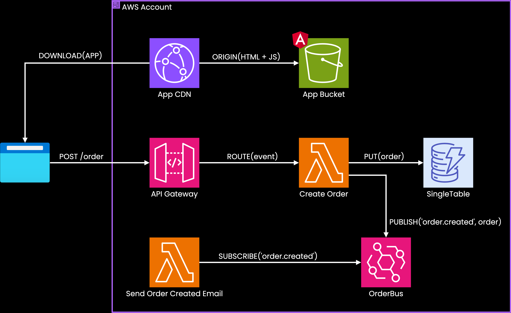

# Splitty Starter

**Splitty Starter** è un progetto di esempio che illustra le tecnologie e le best practice utilizzate in **Splittypay**, il prodotto "Buy Now, Pay Later" di **Avvera - Gruppo Credem S.p.A.**  
Splittypay consente di suddividere il pagamento di un acquisto in più rate, sia in negozi fisici che online.

---

## 🧩 Scopo del Progetto

Splitty Starter funge da starter kit per dimostrare l’architettura serverless adottata in Splittypay.  
La monorepo contiene una semplice applicazione per la **gestione ordini**, con relative API per:

- Creazione di un ordine
- Pagamento di un ordine
- Elenco degli ordini
- Cancellazione di un ordine

---

## ⚙️ Tecnologie Utilizzate

Il progetto è basato interamente su un’architettura **serverless** in **AWS**, e include:

- **API Gateway** – per la gestione delle richieste HTTP
- **AWS Lambda** – per l'esecuzione della logica applicativa
- **DynamoDB** (Single Table Design) – per la gestione dello stato e dei dati
  - Gestita tramite [**ElectroDB**](https://github.com/tywalch/electrodb), una libreria per modellare e interagire con DynamoDB in maniera dichiarativa

- **EventBridge** – per la gestione degli eventi asincroni
- **SES** – per l'invio di email di notifica
- **S3** – per lo storage statico del frontend

### 🔄 Flusso di Creazione Ordine

Di seguito viene mostrato il flusso di creazione di un ordine, dalla navigazione dell'app fino al click del button di creazione ordine:



---

## 📁 Struttura della Monorepo
    splitty-starter/
    │
    ├── packages/
    │ └── api/ # Handler associabili a Lambda
    │ ├── core/ # Funzioni che incorporano logica ben definita su una entità
    │ ├── frontend/ # HTML+JS realizzato con Vite
    │ └── subscriber/ # Handler associabili a Eventbridge
    |
    └── infra/ # Definizione delle risorse AWS (es: via SST e Pulumi)
---
## 🚀 Obiettivi

- Fornire una base condivisa per lo sviluppo di servizi su Splittypay
- Standardizzare l’adozione delle tecnologie AWS serverless
- Introdurre le practice di design come:
  - **Single Table Design**
  - **Domain-Driven Design (DDD)**
  - **Function-as-a-Service (FaaS)**

---
## 🛠️ Setup e Avvio
> ⚠️ È richiesto un account AWS configurato con le giuste credenziali.  
> Questo progetto utilizza [**Bun**](https://bun.sh) come package manager ed esecutore di script, e [**SST**](https://sst.dev) per l'infrastruttura e lo sviluppo locale.

### 🔧 Installazione delle dipendenze

```bash
# Clona il repository
git clone https://github.com/tuo-utente/splitty-starter.git
cd splitty-starter

# Installa le dipendenze nella root del progetto
bun i

# 🔐 Impostazione del secret (es. chiave privata Stripe)
bun run sst secret set StripeApiKey <your stripe private key>


# 🧪 Avvio in modalità sviluppo con debugger live
bun run sst dev --stage <your stage>
Questo comando avvia un tunnel locale che collega direttamente le Lambda al tuo ambiente di sviluppo.

# 🚀 Deploy su AWS
bun run sst deploy --stage <your stage>

```
## 🧪 Challenge: Metti alla prova la tua padronanza

Vuoi testare la tua comprensione dell’architettura e delle tecnologie di Splitty Starter?  
Esegui una **fork del progetto**, lavora sulla tua repo personale e prova a completare queste challenge:

1. ✅ **Modifica ordine da dialog di dettaglio**  
   Aggiungi una funzionalità che consenta, dalla vista di dettaglio di un ordine, di **modificare il nome dell’ordine** tramite API e aggiornamento su DynamoDB.

2. 💸 **Refund ordini completati**  
   Aggiungi la possibilità di effettuare il **rimborso (refund)** di un ordine, **solo se** si trova nello stato `COMPLETATO`.

3. ⏳ **Cancellazione automatica dopo 24h**  
   Implementa un meccanismo per **cancellare automaticamente** gli ordini non completati (`PENDING`) dopo **24 ore dalla loro creazione**.
   
4. 🧱 **Rifacimento dell'applicazione frontend con Angular**  
   Ricrea l’interfaccia dell’app di gestione ordini utilizzando **Angular**, mantenendo l’interazione con le API esistenti. 